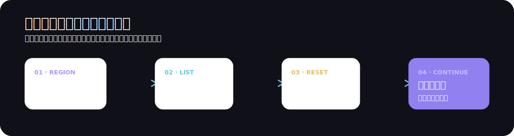

<p align="center">
  
</p>

<p align="center">
  <a href="https://miponianyou.github.io/NTE-Flowboard/">在线使用</a>
  <span>&nbsp;·&nbsp;</span>
  <a href="#快速开始">本地运行</a>
  <span>&nbsp;·&nbsp;</span>
  <a href="#可选云端同步">云端同步</a>
</p>

<p align="center">
  
  
  
</p>

NTE Flowboard 是一个为《NTE》周期内容准备的清单看板。选择你的服务器后，把每日、每周与每月事项放在同一个地方追踪；数据默认仅保存在浏览器中，离线也可使用。

<p align="center">
  
</p>

## 一眼看清本轮要做什么

默认清单覆盖常见的周期性内容：

- **每日**：地图交互、咖舍收益、角色羁遇、像素与家具材料。
- **每周**：异象巡礼、都市活力、宝库、送货、拍卖与通行证任务。
- **每月**：集市迷迭、大亨猎人、玩法异境等商店兑换。

应用会根据所选服务器计算重置时间：亚太服固定为 UTC+8；美服和欧服会处理夏令时。默认重置节点为每日 05:00、每周一 05:00 与每月 1 日 05:00。

## 用清单而不是记忆管理周期

- 添加自定义事项，编辑名称与标签。
- 勾选完成；可设置将完成项自动移动到列表末尾。
- 拖拽排序，按标签查找，并可临时隐藏以后再恢复。
- 进度环显示当前周期的完成数量；删除前可要求二次确认。
- 多个浏览器标签页会通过本地存储事件保持数据一致。

## 数据优先留在本地

清单与偏好默认使用浏览器 `localStorage` 保存，不需要账户，也不依赖网络连接。首次加载会自动迁移旧版 `nte-checklist-data` 数据。

## 可选云端同步

需要跨设备时，可以在设置中填写自己的 Supabase Project ID 与 Anon Key。同步通过两个 RPC 完成：

```text
本地变更  →  upsert_sync  →  Supabase
Supabase  →  pull_sync     →  本地状态
```

Project ID 与 Anon Key 保存在当前浏览器的 `localStorage`。Anon Key 是前端公开凭据，实际的数据访问权限由 Supabase 的 Row Level Security (RLS) 控制。

> 配置同步前，请先在 Supabase 项目中启用并验证 RLS。RLS 配置错误时，持有项目公开凭据的人可能读写同步数据。

## 快速开始

直接使用：<https://miponianyou.github.io/NTE-Flowboard/>

本地开发需要 Node.js 20+：

```bash
git clone https://github.com/MiPoNianYou/NTE-Flowboard.git
cd NTE-Flowboard
npm install
npm run dev
```

## 开发与验证

| 命令 | 作用 |
| --- | --- |
| `npm run dev` | 启动开发服务器 |
| `npm run test` | 运行 Vitest 测试 |
| `npm run lint` | 检查 `src/` |
| `npm run typecheck` | 运行 TypeScript 检查 |
| `npm run format:check` | 检查格式 |
| `npm run build` | lint、类型检查与生产构建 |

提交前按 CI 顺序运行：

```bash
npm run format:check
npm run test
npm run build
```

<details>
<summary>项目结构</summary>

```text
src/
  components/       界面与交互组件
  context/          全局设置状态
  hooks/            清单、同步、交互逻辑
  tests/            业务行为与数据契约测试
  utils/            存储、迁移、时间与服务接口
  system.css        Liquid Glass 设计令牌
```

</details>

## 技术栈

React 19 · TypeScript · Vite 8 · Tailwind CSS 4 · Motion · dnd-kit · Supabase · Vitest

## 发布

推送到 `main` 后，GitHub Actions 会依次执行格式检查、测试、构建，并部署到 GitHub Pages。

<p align="center"><sub>MIT License</sub></p>
