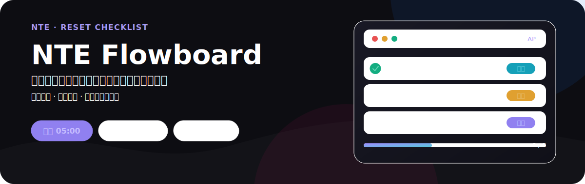
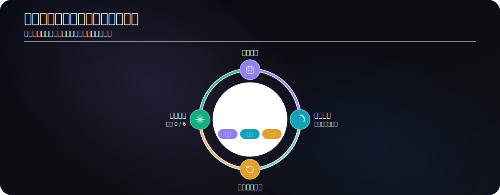

<p align="center">
  
</p>

<h1 align="center">NTE Flowboard</h1>

<p align="center">
  用于追踪《NTE》每日、每周和每月重置事项的本地优先清单看板。
</p>

<p align="center">
  <a href="https://miponianyou.github.io/NTE-Flowboard/">在线使用</a>
  <span>&nbsp;·&nbsp;</span>
  <a href="#快速开始">本地运行</a>
  <span>&nbsp;·&nbsp;</span>
  <a href="#可选云端同步">云端同步</a>
</p>

<p align="center">
  
  
  
</p>

<p align="center">
  
</p>

> 选好服务器，按清单完成这一轮；到重置时间，下一轮会自动开始。

## 一眼看清本轮要做什么

NTE Flowboard 将常见的周期事项分为每日、每周和每月三份清单。你可以添加自定义任务、编辑标签、拖拽排序或暂时隐藏任务；完成后的任务也能自动移到列表末尾。进度环会显示这一轮已完成的数量。

| 周期 | 默认追踪内容                                     | 重置时点        |
| ---- | ------------------------------------------------ | --------------- |
| 每日 | 地图交互、咖舍收益、角色羁遇、像素与家具材料     | 每日 05:00      |
| 每周 | 异象巡礼、都市活力、宝库、送货、拍卖与通行证任务 | 每周一 05:00    |
| 每月 | 集市迷迭、大亨猎人、玩法异境等商店兑换           | 每月 1 日 05:00 |

<p align="center">
  
</p>

## 按服务器时间自动重置

- 可选择亚太服、美服或欧服；美服和欧服会自动处理夏令时。
- 每日 05:00、每周一 05:00 和每月 1 日 05:00，分别重置对应清单。
- 离线也能用。多个浏览器标签页会通过本地存储保持一致。

## 数据默认留在你的浏览器里

清单和偏好默认保存在浏览器的 `localStorage` 中，不需要账户，也不依赖网络。首次加载时会自动迁移旧版 `nte-checklist-data` 数据。

## 可选云端同步

跨设备使用时，在设置中填写自己的 Supabase Project URL 与 Publishable Key：

```text
本地变更  →  upsert_sync  →  Supabase
Supabase  →  pull_sync     →  本地状态
```

Project URL 与 Publishable Key 只保存在当前浏览器。Publishable Key 是前端公开凭据；实际的数据访问权限由 Supabase 的 Row Level Security (RLS) 控制。旧项目的 Anon Key 也可继续使用。

> 配置同步前，请先在 Supabase 项目中启用并验证 RLS。RLS 配置错误时，持有项目公开凭据的人可能读取或写入同步数据。

## 快速开始

直接使用：<https://miponianyou.github.io/NTE-Flowboard/>

本地开发需要 Node.js 20+：

```bash
git clone https://github.com/MiPoNianYou/NTE-Flowboard.git
cd NTE-Flowboard
npm install
npm run dev
```

## 开发与验证

| 命令                   | 作用                              |
| ---------------------- | --------------------------------- |
| `npm run dev`          | 启动开发服务器                    |
| `npm run test`         | 运行 Vitest 测试                  |
| `npm run test:watch`   | 监听测试变更                      |
| `npm run lint`         | 检查 `src/`                       |
| `npm run typecheck`    | 运行 TypeScript 检查              |
| `npm run format:check` | 检查格式                          |
| `npm run build`        | 运行 lint、类型检查并生成生产构建 |

提交前请按 CI 的顺序运行：

```bash
npm run format:check
npm run test
npm run build
```

<details>
<summary>项目结构</summary>

```text
src/
  components/       界面与交互组件
  context/          全局设置状态
  hooks/            清单、同步、交互逻辑
  tests/            业务行为与数据契约测试
  utils/            存储、迁移、时间与服务接口
  system.css        Liquid Glass 设计令牌
```

</details>

## 技术栈

React 19 · TypeScript · Vite 8 · Tailwind CSS 4 · Motion · dnd-kit · Supabase · Vitest

## 发布

推送到 `main` 后，GitHub Actions 会依次检查格式、运行测试、构建并部署到 GitHub Pages。

<p align="center"><sub>MIT License</sub></p>
